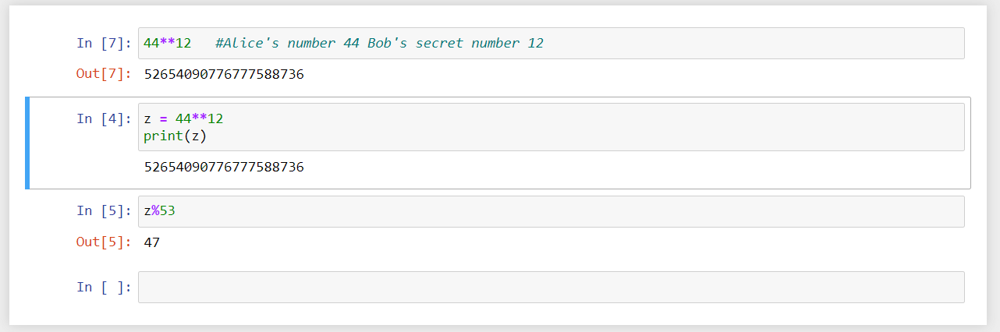

<!-- PROJECT LOGO -->
 

  

  <h3 align="center">Diffie-Hellman Key Exchange</h3>

  

<!-- ABOUT THE PROJECT -->
## Introduction

We want to transfer data between two different regions and we do not want this data to be read by others. Naturally, we encrypt this data and share encrypted data. The side sends the data which is encrypted by using a password and sends it to the other side. The other side uses the same password and decrypts the ciphertext with no time significance. In this case, both sides should know the same password. It is not possible for us to send the password manually to the other party or to use the same password all the time because when using the internet, you will have to send something physical and secure to another country, which is very difficult. Similarly, using the same key will create vulnerability against the possibility of finding the key for a certain period. For these reasons both sides will have to agree on a key quickly and securely whenever they want. At this point, we will examine one of the developed methods, Diffie-Hellman Key Exchange.

(<a href="#top">back to top</a>)

## Mathematical Background

The working logic of Diffie-Hellman Key Exchange is based on a simple mathematical fact.

According to this:

The numbers a and b in this formula are random numbers that both parties create 
and do not share. These numbers will be used to create the secret password that 
will be agreed upon.

To understand the formula, we can look at the following example.

We can see that changing the order of the exponential products does not 
change the result and gives the number 6561.

(<a href="#top">back to top</a>)

<!-- GETTING STARTED -->
## Diffie-Hellman key exchange

This is an example of how you may give instructions on setting up your project locally.
To get a local copy up and running follow these simple example steps.

In this section, a simple example explaining the method will be examined step by step.

In a Diffie-Hellman key exchange, the parties first begin by mutually agreeing
on two publicly available numbers. These are the modulus (p) and the base (g).
The modulus is usually set as a very large prime number, but in this example
we will continue by choosing two small primes.

Everyone can see the p and g numbers alice and bob agreed on.

After this operation, alice generates a number that only she knows and 
does not share. Bod does the same.

Alice generates a

Bob generates b

Alice does the following calculations and sends the number she finds to Bob.
This number is visible to everyone.

Bob does the same thing.

The latest situation can be summarized as follows:

After these transactions are completed, Alice and Bob perform the following operations and create the secret key they agreed on.

Alice's calculations:

Bob's calculations:

If you look carefully, you can see that the numbers in exit 5 and exit 10 are the same and it is 47.

The number 47 is the shared secret key and Eve or others cannot see this number. The latest situation is as follows.

Eve needs to find the unshared numbers a and b to find the number 47.

Eve must solve the following equations to get 47. If he can reach either 
Alice or Bob, he'll already get 47, right?

Finding the numbers a and b from these equations is much more 
difficult than the operations of alice and bob, but it is not
impossible.

Larger numbers are used to complicate the solution of these
equations. Of course, it seems that the developing technology 
will lead us to develop new technologies such as quantum key exchange.

<!-- CONTACT -->
## Contact

Hasan Yiğit Linkedin- [@ygthasan](https://www.linkedin.com/in/ygthasan/) 

Web: [https://ygth.de](https://ygth.de/)

<a href="https://github.com/othneildrew/Best-README-Template"><strong> readMe.md template</strong></a>

(<a href="#top">back to top</a>)

